<div align="center">



# Synapse

### Deep learning from scratch. No frameworks, no magic, just code, math, and whatever intuition I can build along the way.

[](LICENSE.md)
[](https://numpy.org)
[]()
[](CONTRIBUTING.md)

</div>

## Okay so... why does this exist?

I got tired of calling `model.fit()` and having no real idea what was happening inside. Like yeah, the loss goes down and the accuracy goes up, but what actually changed in the weights? How did backprop know which direction to nudge things? I wanted to actually *see* it.

Synapse is me working through deep learning from the absolute bottom up. Build the simplest possible version of something first, watch it work (or fail), understand why, and only then move on to the next thing. Everything here is plain Python with NumPy and Matplotlib. No PyTorch, no TensorFlow, not until the very end when I already know what's happening inside and just want to see how the frameworks wrap it up.

The plan is to start with a neuron learning to add two numbers, and eventually end up looking at DNA and proteins through the same mathematical lens. Because honestly, the line between "neural network" and "neuron" is way thinner than I thought.

## How to read this

This isn't a reference manual. It's more like a lab notebook I'm keeping while I figure things out. Three habits that help:

**Guess before you run.** Before hitting shift+enter, try to predict the output. The moments you're wrong are where the real learning happens.

**Break things on purpose.** Crank the learning rate up 10x. Yank out the activation function. Delete a layer. Watch what breaks and ask why.

**Inspect everything.** Print the weights mid-training. Plot the gradients. Watch the loss curve move (or refuse to). If a number flows through the network, you should be able to see it.

Each notebook follows the same shape: intuition first, then math, then code, then experiments to mess around with. The intuition part is there so even if you skip every equation, you still get what the algorithm is trying to do.

## The roadmap

The sections build on each other deliberately. Each one reuses the building blocks from the last, so the "from scratch" code you write early keeps paying off.

### 01 — Numbers

Where it all begins: a computer learning that 2 + 3 = 5.

The smallest possible neural network, one that learns to add, written in about 100 lines. Every line is there for a reason: neurons, layers, the forward pass, ReLU, mean squared error, backpropagation, and gradient descent. The point isn't the arithmetic (computers can already add). The point is watching numbers flow forward through a network and gradients flow backward, until both feel like physical things you can picture.

| Notebook | Focus |
|---|---|
| `adding_two_numbers.ipynb` | A full neural network from scratch: forward pass, loss, backprop, gradient descent |
| *(planned)* `multiplying_one_number.ipynb` | Linear regression as a single neuron |
| *(planned)* `iris_classification.ipynb` | Multi-class classification, softmax, cross-entropy |
| *(planned)* `loss_landscapes.ipynb` | Visualizing why some problems are harder than others |
| *(planned)* `optimizers.ipynb` | SGD, momentum, and Adam, implemented and compared |

### 02 — Images

Numbers in a grid are still just numbers.

The leap from "a list of numbers" to "a picture" is mostly about structure, not magic. This section builds a feedforward network for MNIST, then asks why it's not enough, which motivates convolutions, pooling, batch normalization, and dropout from first principles. Ends with peeking inside the network to see what the filters actually learned.

- A feedforward classifier for handwritten digits
- Convolutions, implemented by hand, with visual intuition for "sliding a filter"
- The tricks that make deep networks trainable: pooling, batchnorm, dropout
- Visualizing filters and activation maps
- Data augmentation as a way of teaching invariance

### 03 — Text

Sequences, attention, and the stuff that makes transformers work.

Text breaks the assumption that order doesn't matter. This section is the longest for a reason: tokenization, embeddings, and recurrence are each harder than they look, and attention (the mechanism behind transformers) only clicks once you've felt the limits of what came before it. Ends with a miniature GPT small enough to hold in your head.

- Tokenization, and why turning words into numbers is trickier than it sounds
- Word embeddings and the geometry of meaning
- Recurrent networks, built from scratch
- LSTMs and GRUs, and the vanishing gradient problem they solve
- The attention mechanism, the engine behind transformers
- A miniature GPT

### 04 — Biological

Where the code and the biology start to blur.

Everything up to this point was building toward a question: how much of this was *inspired* by biology, and how much of it actually *applies* back? This section takes the sequence models from section 03 and points them at DNA, looks at how amino acid sequences fold into 3D protein structures, and uses dimensionality reduction on gene expression data. Closing the loop back to the neuron that started it all.

- DNA as a sequence: reusing section 03's tools on nucleotides
- From amino acids to 3D coordinates: the concepts behind protein structure prediction
- Clustering and dimensionality reduction on gene expression data
- The neuron-to-neural-network connection, revisited

### 05 — Frameworks

Now that I actually know what's happening inside...

Every problem from sections 01 to 04 gets reimplemented in PyTorch and TensorFlow/Keras. This time `model.fit()` won't feel like a black box, because I'll recognize every step it's hiding. Closes with some practical thoughts on when to reach for a framework, and when writing it yourself is still the right call.

- Sections 01 to 04, reimplemented in PyTorch
- The same problems, reimplemented in TensorFlow/Keras
- What `model.fit()` actually does, step by step
- When to use which framework, and when to use neither

## Getting started

```bash
# Clone the repo
git clone https://github.com/MubiruEltonFelix1/synapse.git
cd synapse

# Create a virtual environment
python -m venv venv
source venv/bin/activate   # venv\Scripts\activate on Windows

# Install dependencies
pip install numpy matplotlib jupyter

# Launch Jupyter
jupyter notebook
```

No GPU required. Everything in sections 01 to 03 runs comfortably on a laptop.

## Why "Synapse"

A synapse is the small gap between neurons where a signal crosses over and, in some tiny way, learning happens. I picked the name for three reasons: it's the biological connection point this journey eventually reaches, it's where information gets transformed and passed forward (exactly what a layer does), and it's small and fundamental, which is the whole spirit of building things from the smallest possible pieces.

---

## People who taught me

This project stands on the shoulders of people who taught generously:

**Buri Gerhom**, lecturer at Mbarara University of Science and Technology — taught me the math underneath all of this. Gradient descent, the chain rule, and the calculus that makes neural networks work. Every backpropagation derivation here traces back to those lectures.

**Andrej Karpathy**, whose *micrograd* and *Neural Networks: Zero to Hero* series basically defined the whole "build it yourself, in plain Python" philosophy of this repo.

**3Blue1Brown**, whose neural network series remains the gold standard for visual intuition about what these networks are actually doing.

## A note on the code style

I wrote this in an object-oriented style: `Neuron`, `Layer`, and `Network` classes that contain each other, mirroring the structure of the network itself. Not because OOP is the "right" way to write neural networks (a functional style works just as well), but for three reasons: most real-world deep learning code is written this way so it's worth being comfortable with, the nesting of objects mirrors the actual structure of a network in a way that's satisfying to read, and it forces me to think clearly about which weights and gradients live where.

<div align="center">

*"What I cannot create, I do not understand." — Richard Feynman*

This is my solo learning journey, but learning is always better together. Open an issue or start a discussion if you're following along with your own.

See [CONTRIBUTING.md](CONTRIBUTING.md) for how to get involved, and [LICENSE.md](LICENSE.md) for usage terms.

</div>
